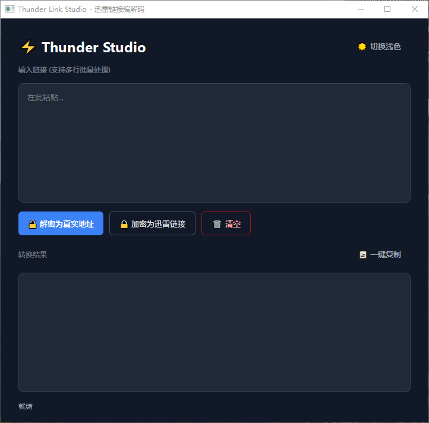

这里是为你量身定制的 `README.md`，已经将项目名称和你的专属 GitHub 仓库链接完美整合进去了。你可以直接复制并提交到你的仓库中：

```markdown
# ⚡ ThunderLink Tool (迅雷链接转换大师)

[](https://www.python.org/)
[](https://pypi.org/project/PyQt6/)
[](LICENSE)
[](https://github.com/BD6JZU/ThunderLink-Tool/stargazers)

**ThunderLink Tool** 是一款高颜值、现代化的迅雷链接（`thunder://`）双向转换工具。基于纯 Python 和极度稳定的 PyQt6 打造，告别简陋的传统界面，提供像素级的 UI 质感与极佳的交互体验，支持多行批量处理与严格的协议校验。

---

## ✨ 核心特性

- 🌗 **现代感 UI & 主题切换**：纯写 QSS 打造的圆角扁平化界面，一键无缝切换**深色/浅色**主题。
- ⚡ **双向协议转换**：
  - **解密**：将 `thunder://` 开头的加密链接还原为真实的 `http/https/ftp/ed2k` 等真实下载地址。
  - **加密**：将普通下载链接一键打包为迅雷专属协议链接。
- 📦 **高效批量处理**：支持一次性粘贴多行（几十上百行）链接，瞬间完成批量转换。
- 🛡️ **智能校验与纠错**：
  - 解密时：严格校验 Base64 合法性，防止乱码。
  - 加密时：严格校验协议头（必须为 http/ftp/ed2k/magnet 等），自动拦截普通纯文本。
  - **优雅排错**：对非法链接自动跳过，并弹出**带滚动条的错误明细对话框**，精准定位到具体错误行号与原因，不影响正常链接的转换。
- 📋 **极简交互**：提供状态提示栏、一键复制结果、一键清空工作区功能。

---

## 📸 界面预览

*(建议将运行截图命名为 light.png 和 dark.png 放入 screenshots 文件夹后，取消下方注释)*


 

---

## 🚀 快速开始

### 1. 环境要求
- Python 3.8 或更高版本

### 2. 克隆项目
```bash
git clone https://github.com/BD6JZU/ThunderLink-Tool.git
cd ThunderLink-Tool
```

### 3. 安装依赖
本项目仅依赖成熟且稳定的 GUI 框架 PyQt6：
```bash
pip install PyQt6
```

### 4. 运行程序
```bash
python main.py
```

---

## 📦 打包为EXE程序 (可选)

如果你想将其打包为无需 Python 环境即可双击运行的 `.exe` 独立程序，可以使用 PyInstaller：

```bash
pip install pyinstaller
pyinstaller -F -w main.py
```
*参数说明：`-F` 生成单文件，`-w` 隐藏控制台黑框。*
运行结束后，可在生成的 `dist` 目录下找到可执行文件。

---

## 🛠️ 技术栈
- **UI 框架**：[PyQt6](https://riverbankcomputing.com/software/pyqt/)
- **核心逻辑**：Python 内置 `base64` 库
- **样式设计**：QSS (类 CSS 语法) 搭配精调的 TailwindCSS 调色板
- **异步提示**：基于 `QTimer` 实现的防抖动单例弹窗

## 📄 开源协议
本项目基于 [MIT License](LICENSE) 协议开源，你可以自由地学习、使用、修改和二次分发。
```